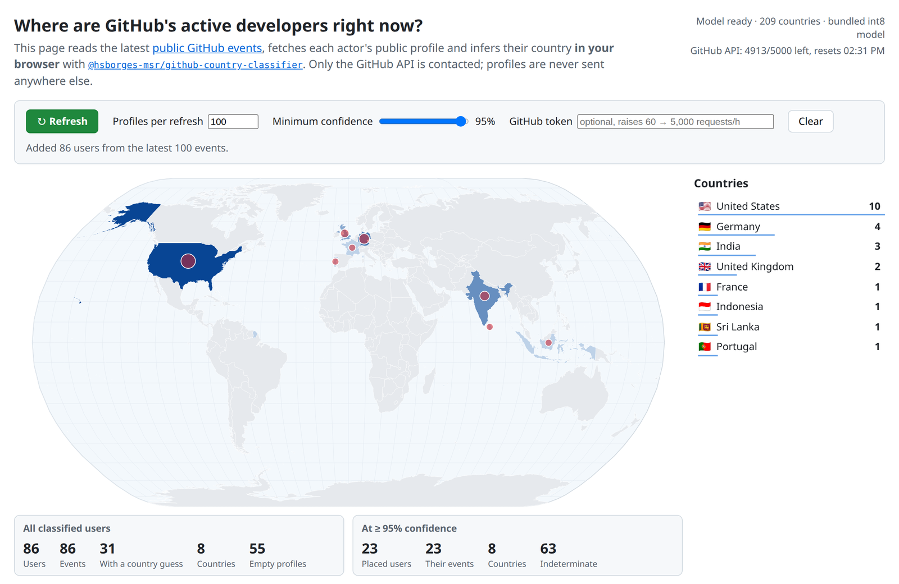
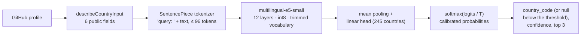
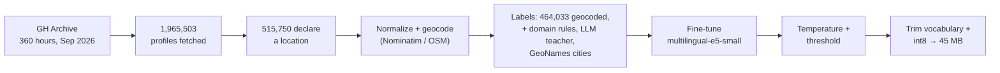

<div align="center">

# GitHub Country Classifier

**Where is a developer from? A compact, calibrated model that reads a GitHub profile and answers the country,
offline, in Node or in the browser.**

[](https://github.com/hsborges-msr/github-country-classifier/actions/workflows/ci.yml)
[](https://github.com/hsborges-msr/github-country-classifier/releases)
[](https://hsborges-msr.github.io/github-country-classifier/)
[](LICENSE)

**[Try the live demo →](https://hsborges-msr.github.io/github-country-classifier/)** It reads GitHub's latest public
events, classifies each author in your browser and puts them on a world map.

<a href="https://hsborges-msr.github.io/github-country-classifier/"></a>

</div>

Only about one in four active GitHub users fills in the `location` field (26% in our sample of 1.97M), and when they
do it is free text: "SF Bay Area",
"Planet Earth", "深圳", "🇧🇷". Yet the rest of a profile often says where someone is: an employer, a `.de` email domain,
a bio in Portuguese. This package turns those signals into an ISO country code with a calibrated confidence, using a
fine-tuned multilingual transformer that ships inside the package and runs on your machine.

| | |
| --- | --- |
| 🎯 **Accurate** | **98.7%** on 46,518 held-out users who declare a location (95% CI 98.5–98.8%), across **245 countries** |
| 🔍 **Beyond the location field** | **95.8%** on held-out users with *no* declared location whose profile names a place elsewhere |
| 🤐 **Abstains when unsure** | By default answers only at ≥ 98.6% confidence, a threshold set for 95% precision on profiles without their location: `null` instead of a guess |
| ⚡ **Fast and local** | ~**15 ms per profile** on a 2015 laptop CPU; no API calls, no profile text leaves your process or browser tab |
| 📦 **Self-contained** | The 45 MB model is in the package: one `npm install`, no downloads at run time, no service to host |
| 🌍 **Multilingual** | Built on `multilingual-e5-small`; reads places and bios in Latin, Cyrillic, Chinese, Japanese and Korean script alike |
| 🛡️ **Privacy by design** | Never reads the login or the name, nor the local part of an email |

```ts
const { classify } = await loadCountryClassifier();
await classify([describeCountryInput({ location: "Porto Alegre, RS", bio: "Desenvolvedor backend" })]);
// [{ country_code: "BR", confidence: 0.999, top: [["BR", 0.999], ...] }]
```

## Quick start

The package is published as a tarball on this repository's
[releases](https://github.com/hsborges-msr/github-country-classifier/releases) (not on the npm registry). Install it with
the ONNX Runtime for your platform:

```sh
# Node
npm install https://github.com/hsborges-msr/github-country-classifier/releases/download/v0.2.0/hsborges-msr-github-country-classifier-0.2.0.tgz onnxruntime-node
# Browser (with a bundler such as Vite or webpack 5)
npm install https://github.com/hsborges-msr/github-country-classifier/releases/download/v0.2.0/hsborges-msr-github-country-classifier-0.2.0.tgz onnxruntime-web
```

```ts
import { describeCountryInput, loadCountryClassifier } from "@hsborges-msr/github-country-classifier/node"; // or "/web"

const { classify } = await loadCountryClassifier();
const profile = await (await fetch("https://api.github.com/users/octocat")).json();
const [prediction] = await classify([describeCountryInput(profile)]);
// { country_code: "US", confidence: 0.9991, top: [["US", 0.9991], ["CA", 0.00009], ["IN", 0.00008]] }
```

The tarball is 32 MB (62 MB unpacked), almost all of it the model; ONNX Runtime is an optional peer dependency, so
install only the one you use.

## Results

Evaluated with ONNX Runtime on the shipped model file, one profile per run, as the package runs it (the JavaScript
runtimes are tested to give the same answers as the Python evaluation). None of these users was used for training or
calibration. Intervals are Wilson 95% intervals.

| Evaluation set | Majority class | Always answering | ≥ 50% confidence | ≥ 90% | Default threshold (98.6%) |
| --- | --- | --- | --- | --- | --- |
| **Test split**: 46,518 users who declare a location | 16.5% (US) | **98.7%** (98.5–98.8) | 99.4% precision, 98.8% answered | 99.8% / 97.1% | **99.9%** (99.9–100) / 93.5% |
| **Location hidden**: the same users with the `location` line removed (11% are left with nothing) | 16.5% (US) | 44.1% (43.7–44.6) | 84.3% / 36.3% | 94.2% / 23.2% | **96.6%** (96.2–97.0) / 13.9% |
| **Teacher test set**: 285 users without a location who name a place elsewhere | 18.9% (US) | **95.8%** (92.8–97.6) | 98.5% / 94.7% | 99.6% / 87.0% | **100%** (98.0–100) / 66.0% |
| **Domain test set**: 2,741 users without a location whose email or blog domain names a country | 35.0% (CN) | 98.5% (97.9–98.9) | 99.5% / 98.3% | 99.7% / 95.4% | 99.9% (99.7–100) / 83.9% |

*Precision* counts correct answers among those at or above the minimum confidence; *answered* is the share of profiles
that reach it. The default threshold is the lowest confidence at which validation precision reaches 95% both for users
with their location and for the same kind of users with it removed, the harder case, which sets it. Pass a lower
`threshold` to answer more profiles at lower precision.

**Compression is almost free in accuracy.** The shipped model is 10× smaller than the full-precision export and loses
0.1–0.4 points when always answering. It is slightly less confident at the top, so at the default threshold it
answers fewer profiles, with the same or higher precision:

| Model | Size | Test split | Teacher test set | Location hidden, at the default threshold |
| --- | --- | --- | --- | --- |
| Full fp32 export | 470 MB | 98.8% | 95.8% | 96.2% precision, 16.0% answered |
| **Trimmed vocabulary, int8, shipped** | **45 MB** | **98.65%** | **95.8%** | **96.6%**, 13.9% |

**Context from the pilot experiments** (smaller samples and earlier dataset versions, so indicative only): a character
n-gram TF-IDF model with logistic regression reached 88.2% on located users and 77.4% on teacher-labelled unlocated
users, and a generative 0.5B-parameter model needed about 1.2 s per profile on the same laptop CPU, about 80 times
slower than this package.

### What the numbers mean

- **The test split is mostly about reading a declared location.** Those users keep their `location` line in the input,
  as they would at inference. 98.8% is therefore the model's skill at turning messy free text ("NYC", "Bengaluru,
  Karnataka", "Москва") into a country, plus whatever the other fields add.
- **Location hidden is the pessimistic case.** Its label is the country of the declared location, but the remaining
  fields may say nothing (`email_domain: gmail.com`) or point elsewhere (a foreign employer). It is the set the default
  threshold is calibrated for.
- **The teacher and domain test sets are the optimistic case**: profiles with no location that name a place, labelled
  by a large language model that had to quote its evidence from the profile, or by rules on the email and blog domain.
  Such profiles are a minority: 2.9% of the 100,028 location-less profiles sent to the language model named a place at
  all. Agreement with the domain rules is partly by construction, since the model also learned from them.
- **Labels are geocoder, rule and LLM outputs, not ground truth.** Accuracy is agreement with those labels; all make
  mistakes, so part of the residual error is label noise.

## How it works



1. **Input.** `describeCountryInput` writes one `field: value` line per non-empty field, in the order `location`,
   `company`, `blog`, `email_domain` (the domain of the public email only), `twitter_username`, `bio`, whitespace
   collapsed. The same function built the training data, so the model sees exactly what it was trained on.

   ```text
   location: Recife, Brazil
   company: CESAR
   email_domain: gmail.com
   ```

2. **Tokens.** `"query: " + text` goes through the SentencePiece tokenizer of `multilingual-e5-small`
   ([`@huggingface/tokenizers`](https://github.com/huggingface/tokenizers.js), pure JavaScript), truncated to 96
   tokens.
3. **Network.** ONNX Runtime runs `model/model_int8.onnx`: the encoder (12 transformer layers, hidden size 384), the
   average of its outputs over the tokens, and a linear layer with one score per country.
4. **Answer.** `softmax(logits / temperature)`; the most probable country when its probability reaches the threshold
   (`null` otherwise), its probability and the top three. A profile with none of the six fields answers `null` without
   running the model.

## How the model was built



### Data

- **Users:** every actor of the public GitHub events published by [GH Archive](https://www.gharchive.org/) for the 360
  hours from 2026-09-01 00:00 to 2026-09-15 09:00 UTC: 2,145,782 accounts, of which 1,965,503 profiles were fetched
  from the GitHub REST API (the other 180,279 no longer existed). 515,750 of them (26%) declare a location.
- **Labels:** each free-text `location` was normalized (emoji, URLs, placeholders such as "Planet Earth" or "Remote" and
  joke places removed; abbreviations such as "NYC" expanded) and geocoded with [Nominatim](https://nominatim.org/) (data
  © [OpenStreetMap](https://www.openstreetmap.org/copyright) contributors); low-importance matches sharing no word with
  the query were rejected. 464,036 users had their location resolved to a country, which is their label.
- **Users without a location**, two more label sources: 26,187 whose email or blog domain names a country (a
  country-code ending such as `.de`, or a host such as `qq.com` learned from located users), and 2,922 labelled by
  DeepSeek V4.1 Flash with grounded, quoted evidence and an instruction not to infer from names.
- **Splits:** every source is split by the same hash of the user id, 85% training, 5% validation, 10% test, so no test
  user is trained on through another source. Located users: 394,221 / 23,294 / 46,518 (the most frequent labels are US
  at 16.5%, IN, CN, BR, DE, GB, FR and CA); domain rules: 22,109 / 1,337 / 2,741; teacher: 2,496 / 141 / 285.
- **GeoNames cities:** 23,362 synthetic `location: <city>` rows from the
  [GeoNames](https://www.geonames.org/) cities with at least 15,000 inhabitants (CC BY 4.0), training only, so that
  cities no user wrote are still known. With them the label set covers 245 countries and territories.

### Training

- **Architecture:** [`intfloat/multilingual-e5-small`](https://huggingface.co/intfloat/multilingual-e5-small)
  (Wang et al., 2024; 12 layers, hidden size 384, 118M parameters), mean pooling over the attention mask, dropout 0.1,
  one linear layer over the 245 labels, and the `query: ` prefix the base model expects.
- **Fine-tuning:** all encoder layers except the word embeddings, one epoch over the 442,188 training examples,
  batch 32, AdamW (weight decay 0.01), learning rates 5e-5 for the encoder and 1e-3 for the head, linear schedule with
  6% warm-up, gradient clipping at 1.0: 13,819 steps, about 5 minutes on one GPU in bf16.
- **Location dropout:** the `location` line is removed from 20% of the located training profiles (69,784), so the model
  also learns from the other fields what a located user's profile says without it.
- **Calibration:** temperature scaling (T = 1.058) fitted on the 23,294 validation users by minimum negative
  log-likelihood, with the same 20% location dropout. The threshold is the lowest value (on a 0.01 grid, 0.001 from
  0.95) whose validation precision reaches 95% both for users who kept their location and for the 4,130 whose location
  was removed: 0.986. Users who keep their location reach 95% at any threshold; the location-hidden ones set it.

### Compression

- **Vocabulary trimming.** 96M of the base model's 118M parameters are the embedding table of a 250,037-token
  multilingual vocabulary, most of which GitHub profiles never use. The export keeps only the 57,886 tokens that occur
  at least twice in the inputs of all 1,965,503 profiles. The tokenizer is untouched: the graph starts with a lookup
  from each original token id to its row in the smaller table, and other ids read `<unk>`. On covered texts the trimmed
  network reproduces the full network's logits to within 7.6e-6.
- **Quantization.** ONNX Runtime dynamic quantization (int8 weights, activations quantized at run time) takes the trimmed
  network from 176 MB to 45 MB. Because activation scales are computed per run, the package classifies one profile at a
  time, so an answer never depends on what else is in a batch.

## Limitations and responsible use

- **Estimates, not facts.** The model infers a country from company names, email domains, languages and places in a bio.
  Use it for aggregate questions (where a project's contributors are, how a community is distributed), not to label or
  make decisions about individuals.
- **Calibrated on users who declare a location.** The threshold is set on located users with their location removed,
  and holds on the teacher and domain test sets, but those only cover profiles that name a place somewhere. Most
  location-less profiles name none; for them `null` is the expected answer, and precision on a random sample of them
  is not yet measured.
- **A snapshot of two weeks of activity.** Labels come from users active in September 2026 and from Nominatim's reading
  of their locations. Countries with few users then were learned from few examples, and tokens first seen after the
  collection read as unknown.
- **Names are excluded on purpose.** The login and the name correlate with country through names and ethnicity, which
  this model does not use as evidence.

## API

- **`loadCountryClassifier(source?, options?)`**, from `/node` or `/web`, returns `{ config, classify }`. Without
  `source` it loads the included model. `source` may also be an exported model directory (Node) or its URL (browser):
  `classifier.json`, `tokenizer.json`, `tokenizer_config.json` and `{ onnxFile }`, default `model.onnx` in Node and
  `model_int8.onnx` in the browser. Or it may be a `ModelFiles` object with the path or URL of each file.
- **`classify(texts)`** answers in order: `country_code` (the top country, or `null` below `threshold`; the included
  model's threshold is 0.986, see [Results](#results)), `confidence` and `top` (three most probable countries).
- **Options:** `threshold`, `batchSize`; Node: `threads`; browser: `onProgress`, `cache` (Cache API name, or `false`),
  `wasmPaths`, `executionProviders`, `fetch`.
- **The core entry** (`@hsborges-msr/github-country-classifier`) needs no runtime: `describeCountryInput`,
  `createClassifierFromArtifacts`, `createCountryClassifier` (bring your own `RunLogits`), `predictFromLogits`,
  `parseClassifierConfig`.

### In the browser

The `/web` loader downloads the model once (about 62 MB, less with HTTP compression), keeps it in the Cache API and
reports progress through `onProgress`. The model files are referenced with `new URL("…", import.meta.url)`, so your
bundler emits them as assets.

- **Vite:** exclude `onnxruntime-web` from `optimizeDeps`. ONNX Runtime starts its WebAssembly threads as module workers
  of the chunk that contains it, so that chunk must not import your entry chunk; see [`vite.config.ts`](vite.config.ts).
- **Threads** need a cross-origin-isolated page (`Cross-Origin-Opener-Policy: same-origin` and
  `Cross-Origin-Embedder-Policy: credentialless` or `require-corp`); otherwise ONNX Runtime runs single-threaded.

## Demo

The [live demo](https://hsborges-msr.github.io/github-country-classifier/) (source in [`demo/`](demo), not in the
tarball) reads the latest [public GitHub events](https://docs.github.com/rest/activity/events#list-public-events),
fetches each author's profile, classifies it in the browser and maps the result, with a refresh button, a
minimum-confidence slider, event counts per user, and totals for all users and at the chosen confidence.

- Without a token GitHub allows 60 requests per hour (one per event list, one per profile), so a refresh classifies 20
  profiles; with a token (kept in `sessionStorage`) it classifies a whole page of 100 events.
- Profiles are fetched six at a time through Octokit with throttling and retries; an exhausted quota stops the refresh
  at once instead of waiting up to an hour, and the next refresh picks up where it stopped.
- GitHub Pages cannot send cross-origin isolation headers, so the hosted demo runs on one thread; locally, `yarn demo`
  sends them. `?model=<url>` loads another exported model.

## Development

Clone with [Git LFS](https://git-lfs.com/) installed (the model files are in LFS), then `yarn install`. Development
uses Node 22 (a demo dependency needs it); the package itself supports Node ≥ 20.17.

- `yarn typecheck`, `yarn test` (Vitest, including parity tests against the Python runtime on invented profiles),
  `yarn build`, `yarn demo`, `yarn demo:build`.
- `yarn smoke:pack` packs the package, installs the tarball into a fresh npm project and classifies a profile with both
  entries.
- **Model updates** come from the study repository
  [`hsborges-msr/github-location-inference`](https://github.com/hsborges-msr/github-location-inference) (private; data,
  training code and design records), which includes this repository as a submodule: a new trimmed export is copied into
  `model/` together with updated numbers here and a version bump.
- **Releases:** bump `version` and push the tag `v<version>`; [`release.yml`](.github/workflows/release.yml) tests,
  smoke-tests and attaches the tarball to a GitHub release. [`ci.yml`](.github/workflows/ci.yml) checks every push and
  [`pages.yml`](.github/workflows/pages.yml) publishes the demo.

## Citation

If you use this classifier in research, please cite it (GitHub's "Cite this repository" button reads
[`CITATION.cff`](CITATION.cff)):

```bibtex
@software{borges_github_country_classifier_2026,
  author  = {Borges, Hudson Silva},
  title   = {{GitHub Country Classifier}: Inferring a Developer's Country from Public GitHub Profiles},
  year    = {2026},
  version = {0.2.0},
  url     = {https://github.com/hsborges-msr/github-country-classifier}
}
```

## Acknowledgements and license

MIT, for the code and the model. Built on [`intfloat/multilingual-e5-small`](https://huggingface.co/intfloat/multilingual-e5-small)
(MIT; L. Wang, N. Yang, X. Huang, L. Yang, R. Majumder and F. Wei, *Multilingual E5 Text Embeddings: A Technical
Report*, arXiv:2402.05672, 2024), [ONNX Runtime](https://onnxruntime.ai/) and
[Hugging Face Tokenizers](https://github.com/huggingface/tokenizers.js). Event data from
[GH Archive](https://www.gharchive.org/); locations geocoded with [Nominatim](https://nominatim.org/), data ©
[OpenStreetMap](https://www.openstreetmap.org/copyright) contributors. City names for training from
[GeoNames](https://www.geonames.org/) (CC BY 4.0).
